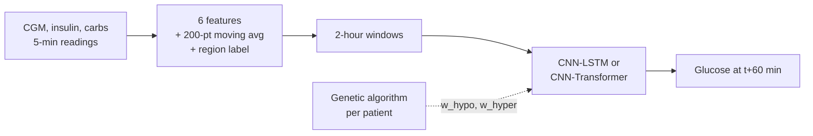

## The question

A continuous glucose monitor paired with an insulin pump can act on a forecast: if the model says glucose will drop below 70 mg/dL in an hour, there's time to prevent it. Most forecasting models, though, are trained to minimize plain average error, so a 20 mg/dL mistake at a safe 120 counts the same as a 20 mg/dL mistake at a dangerous 55.

[GLIMMER](https://arxiv.org/abs/2502.14183) (Khamesian et al.) proposes fixing that with a **region-aware loss** that weights errors by how dangerous the *true* glucose value was, with per-patient weights found by a genetic algorithm. The paper reports that this improves both danger-zone accuracy *and* overall accuracy.

I replicated it from scratch from the paper's text, then asked whether the result holds when you change the architecture and the dataset.

<Callout>
To rule out a fluke of one setup, every result was tested four ways: **two architectures** (CNN-LSTM and CNN-Transformer) × **two independent datasets** (AZT1D and OhioT1DM), with three training approaches each.
</Callout>

## The data

[AZT1D](https://doi.org/10.17632/gk9m674wcx.1) is real-world data from 25 people with type 1 diabetes on automated insulin delivery (Dexcom G6 CGM + Tandem t:slim X2 pump), about a month each, recorded every 5 minutes: glucose, basal and bolus insulin, and logged carbs. OhioT1DM, the paper's second dataset, came through [MetaboNet](https://arxiv.org/abs/2601.11505), a consolidation of 14 public T1D datasets. I validated that loader row by row against my own AZT1D loader before trusting it.

<Figure src="/projects/azt1d-replication/patient-history.png" alt="One patient's full CGM history with hypo and hyper thresholds" caption="One patient's full recorded history. Dashed lines mark the hypo (70) and hyper (180 mg/dL) thresholds." />

A few properties of the data shape what "doing well" even means:

- **Readings lean high, not low.** Glucose is above 180 about 20% of the time and below 70 only about 2%, so the hypo events a model most needs to catch are also the rarest.
- **Some patients are much harder to forecast.** Time in range runs from under 50% to over 90% across patients, and forecast error tracks it closely.
- **Risk climbs through the day.** Hyperglycemia rises from 12.1% overnight to 26.9% in the evening, consistent with meals accumulating.

<Gallery
  columns={2}
  caption="Left: time in range per patient. Right: hypo and hyper rates by time of day across the whole cohort."
  images={[
    { src: "/projects/azt1d-replication/time-in-range.png", alt: "Time in range per subject" },
    { src: "/projects/azt1d-replication/time-of-day.png", alt: "Dysglycemia by time of day" },
  ]}
/>

## Method

Each patient gets their own model, trained on their own history. It looks at the last 2 hours (24 readings) and predicts glucose 60 minutes ahead. The most recent stretch of each patient's data is held out chronologically and never seen during training.



The models follow the paper's Section 5.1: three 1D conv layers feeding either a single 8-unit LSTM (about 10K parameters) or a single 8-head Transformer block (about 50K). The paper leaves filter sizes, lookback, optimizer, and epoch counts unspecified. I chose values that land near its reported parameter counts and documented each choice in the code.

### The region-aware loss

Every error is assigned to a zone by the **true** glucose value, averaged within each zone, then combined with weights (the paper's Eq. 4):

$$
\mathcal{L} = w_{\text{hypo}} \, \text{MAE}_{\text{hypo}} + \text{MAE}_{\text{normal}} + w_{\text{hyper}} \, \text{MAE}_{\text{hyper}}
$$

The normal-range weight is fixed at 1, so $w_{\text{hypo}}$ and $w_{\text{hyper}}$ are the only free parameters.

```python
def region_weighted_loss(pred, target, hypo_threshold, hyper_threshold,
                         w_hypo, w_normal, w_hyper):
    abs_err = torch.abs(pred - target)
    hypo_mask = target < hypo_threshold      # zone is decided by the TRUE value
    hyper_mask = target > hyper_threshold
    normal_mask = ~hypo_mask & ~hyper_mask

    total = torch.zeros((), device=pred.device, dtype=pred.dtype)
    for weight, mask in ((w_hypo, hypo_mask), (w_normal, normal_mask), (w_hyper, hyper_mask)):
        if mask.any():
            total = total + weight * abs_err[mask].mean()
    return total
```

I compared three training approaches, each using the same data, features, and architecture:

| Approach | What changes |
| --- | --- |
| **Standard** | Plain loss; every error counts the same |
| **Fixed danger-weighted** | The paper's published average weights, $w_{\text{hypo}} = 3.29$ and $w_{\text{hyper}} = 2.38$, for every patient |
| **Personalized danger-weighted** | Per-patient weights from the paper's genetic algorithm (Algorithm 1), with validation RMSE as fitness |

<Callout type="warning" title="Deviation from the paper">
The paper's GA budget (population 20 × 25 generations, about 500 trainings per patient) works out to roughly 18+ hours of compute per dataset per architecture here. I kept Algorithm 1's selection, crossover, and mutation exactly, but scoped the search to population 6 × 6 generations and reused known fitness for survivors. This turns out to matter; see below.
</Callout>

## Results

### What the models actually predict

<Figure src="/projects/azt1d-replication/three-predictions.png" alt="Actual glucose vs. three models' 60-minute-ahead predictions on held-out data" caption="Held-out data for one patient. The standard model lags at sharp highs and lows; the danger-weighted models lean high everywhere, which costs accuracy in the normal range but tracks the peaks more closely." />

### Where the errors land

<Figure src="/projects/azt1d-replication/error-by-region.png" alt="Mean absolute error by glucose region for the three approaches" caption="AZT1D, CNN-LSTM. Fixed weighting lowers hypo and hyper error as intended, but normal-range error rises from 20.2 to 32.4 mg/dL." />

That's the mechanism behind everything else: the model does exactly what it's told. It spends capacity on the danger zones and gives up accuracy in the normal range, where most readings are. Overall RMSE gets worse.

### Does it hold up across architectures and datasets?

<Gallery
  columns={2}
  caption="Mean RMSE (mg/dL) for all three approaches and both architectures. Left: AZT1D. Right: OhioT1DM."
  images={[
    { src: "/projects/azt1d-replication/rmse-azt1d.png", alt: "RMSE by approach and architecture on AZT1D" },
    { src: "/projects/azt1d-replication/rmse-ohiot1dm.png", alt: "RMSE by approach and architecture on OhioT1DM" },
  ]}
/>

| RMSE (mg/dL) | Standard | Fixed weighted | Personalized |
| --- | ---: | ---: | ---: |
| AZT1D · CNN-LSTM | **31.54** | 41.18 | 41.12 |
| AZT1D · CNN-Transformer | **32.99** | 40.66 | 41.51 |
| OhioT1DM · CNN-LSTM | **36.79** | 43.14 | 44.13 |
| OhioT1DM · CNN-Transformer | **38.13** | 42.01 | 42.23 |

In all four combinations, standard training has the lowest average error. The two danger-weighted variants land within about 1 mg/dL of each other, in either order.

### Clinically, the trade is real

Average error isn't what a warning system is judged on, so I added event-level metrics and a [Clarke Error Grid](https://en.wikipedia.org/wiki/Clarke_Error_Grid) analysis.

<Metrics items={[
  { label: "Recall, standard", value: "0.51" },
  { label: "Recall, fixed weighted", value: "0.72" },
  { label: "Precision, standard → weighted", value: "0.68 → 0.37" },
]} />

<Figure src="/projects/azt1d-replication/clarke-zones.png" alt="Clarke Error Grid zone percentages for the three approaches" caption="Clarke Error Grid, AZT1D CNN-LSTM. Zone D, a real danger event predicted as normal, drops from 2.4% to 1.3% (fixed) and 1.1% (personalized)." />

<Callout type="result">
Danger-weighted training catches substantially more real hypo and hyper events and roughly halves the most dangerous silent misses (Clarke zone D), at the cost of more false alarms and worse average error. That's GLIMMER's clinical claim, reproduced.
</Callout>

## Comparison to the paper

| RMSE, CNN-LSTM | Paper baseline | Paper GLIMMER | My standard | My personalized |
| --- | ---: | ---: | ---: | ---: |
| AZT1D | 29.55 ± 6.49 | 22.48 ± 3.57 | 31.54 ± 6.10 | 41.12 ± 6.31 |
| OhioT1DM | 31.98 ± 4.15 | 23.97 ± 3.77 | 36.79 ± 4.37 | 44.13 ± 6.83 |

My baseline lands close to the paper's own baseline on both datasets, a basic sanity check that the implementation is sound. But in the paper, GLIMMER *beats* its baseline, while in my replication the personalized model is *worse* than mine. That gap is the headline finding.

### Why the gap? Ranked by evidence

1. **The GA search is about 10× smaller.** This is the only theory with direct evidence. The paper's fixed weights (3.29, 2.38) came from a GA search on OhioT1DM. Running my scoped search on that same dataset, every patient converged on much gentler weights, never anything close. A smaller search settling on weaker corrections is a checkable pattern.
2. **Unspecified architecture details.** Lookback, filter sizes, and training length were my choices. A smaller model has less capacity to be good at both everyday accuracy and danger-zone accuracy at once.
3. **Checkpoint selection.** I keep the epoch with the best plain validation error, even for weighted models, because danger-zone validation scores are noisy on small per-patient slices. Selecting on the danger-zone metric instead would favor weighted models.
4. **Smaller ambiguities.** Some definitions in the paper are given only in prose, and the reported numbers may reflect a best-of-several run.

## Takeaways

- **The replication splits cleanly.** The clinical claim (better detection, fewer dangerous misses) holds on every setup tested. The accuracy claim (better RMSE too) does not reproduce in this implementation.
- **Testing across setups was worth it.** The same ordering on two architectures and two independent datasets is what makes the negative result credible rather than a bug.
- **Unstated details are where replications diverge.** Every assumption is documented inline in the [code](https://github.com/TomerWeissman/azt1d-analysis). The most concrete next step is running the GA at the paper's full budget.
