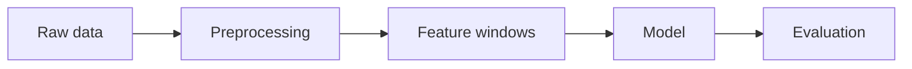

## Writing

Plain Markdown: paragraphs, **bold**, *italics*, [links](https://example.com), and `inline code`.

> Blockquotes work too, for quoting a paper or a result.

## Video

<Video src="https://www.youtube.com/watch?v=aircAruvnKk" caption="Any YouTube or Vimeo share URL works." />

## Diagrams

Write a fenced code block with the language `mermaid`:



Exported diagrams (Excalidraw, draw.io) go in as a `<Figure>`.

## Math

Inline $\hat{y}_t = f_\theta(x_{t-k:t})$, or as a block:

$$
\mathcal{L}(\theta) = \frac{1}{N}\sum_{i=1}^{N} \left( y_i - f_\theta(x_i) \right)^2 + \lambda \lVert \theta \rVert_2^2
$$

## Code

```python
for epoch in range(cfg.epochs):
    for x, y in loader:
        loss = criterion(model(x), y)
        optimizer.zero_grad()
        loss.backward()
        optimizer.step()
```

## Callouts

<Callout>A note for assumptions and asides.</Callout>

<Callout type="result">Reproduced the reported number to within 0.2.</Callout>

<Callout type="warning" title="Deviation from the paper">Where you had to do something differently.</Callout>

## Metrics inline

<Metrics items={[{ label: "RMSE", value: "18.2" }, { label: "MAE", value: "12.9" }]} />

## Tables

| Model | RMSE | MAE |
| ----- | ---: | --: |
| Baseline | 21.3 | 15.8 |
| LSTM | 14.1 | 10.2 |
| **Transformer** | **12.4** | **9.1** |

## Figures

<Figure src="/projects/example-project/figure.svg" alt="Placeholder figure" caption="Figure 1. Click to zoom." />

<Gallery
  caption="A gallery of several figures."
  images={[
    { src: "/projects/example-project/loss-curve.svg", alt: "Loss curve" },
    { src: "/projects/example-project/errors.svg", alt: "Error histogram" },
    { src: "/projects/example-project/ablation.svg", alt: "Ablation" },
  ]}
/>
